# Project 4

**Project task**

To implement a simple Book Register web form using MEAN stack.

started by running `sudo apt update` followed by `sudo apt upgrade`

Got a prompt requesting kernel upgrade:

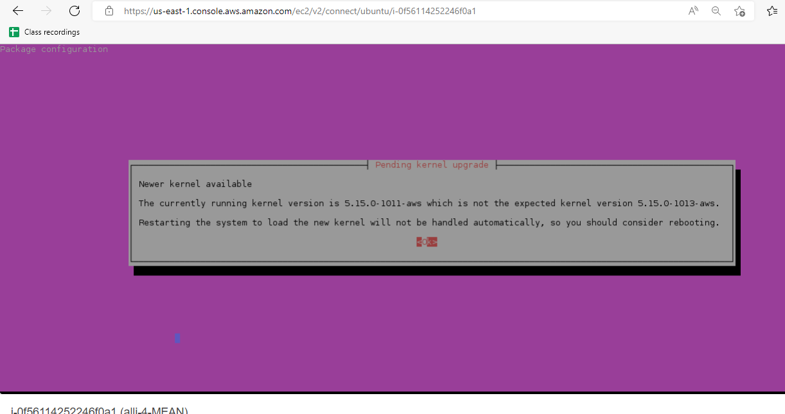

restarted the Ubuntu server from the terminal so that the kernel upgrade will complete

changed to windows terminal afterwards and added required certificates which also confirmed kernel was upgraded

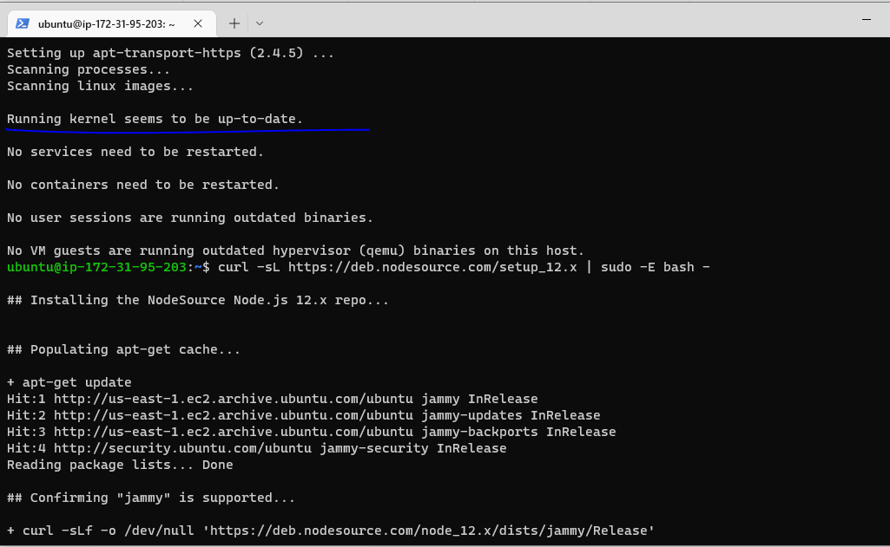

Then, installed node.js

`sudo apt install -y nodejs`

## Install MongoDB

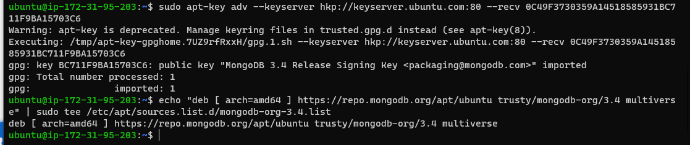

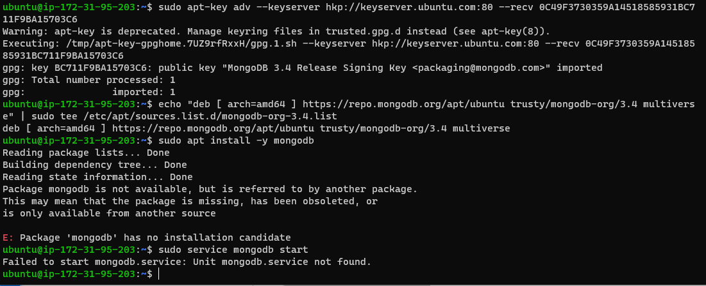

After going through a lot of write ups, I used the steps here to address the error: https://www.mongodb.com/docs/manual/tutorial/install-mongodb-on-ubuntu/ 

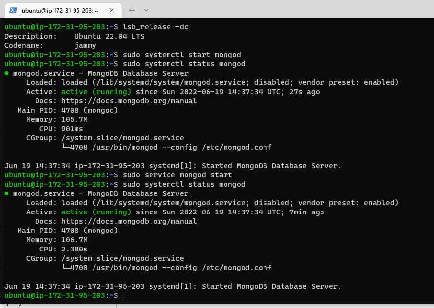

installed npm and checked version:

Followed the documentation to create required directories and files... I also copied and pasted required scripts and html 

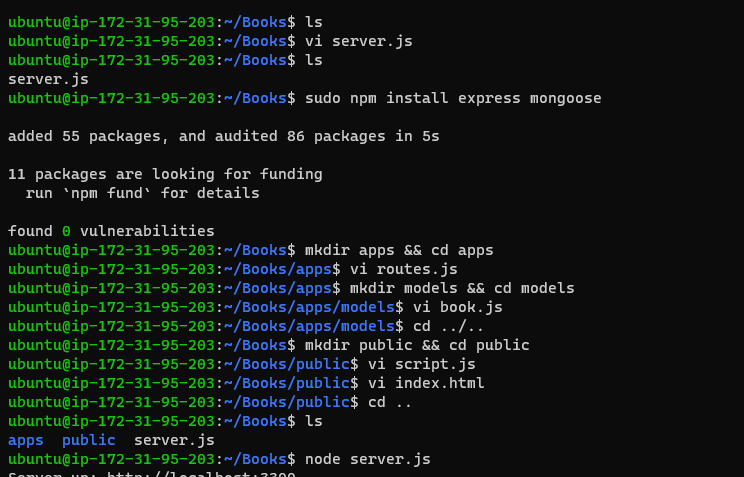

Added TCP port 3300 in my security group in Ubuntu server EC2 instance in AWS.

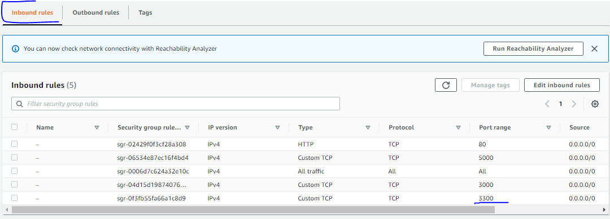

### **webpage result**

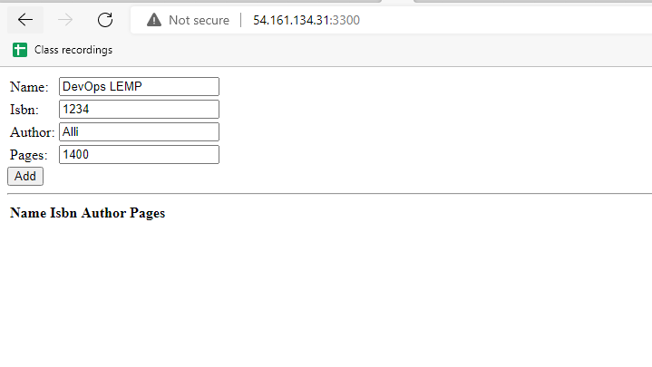

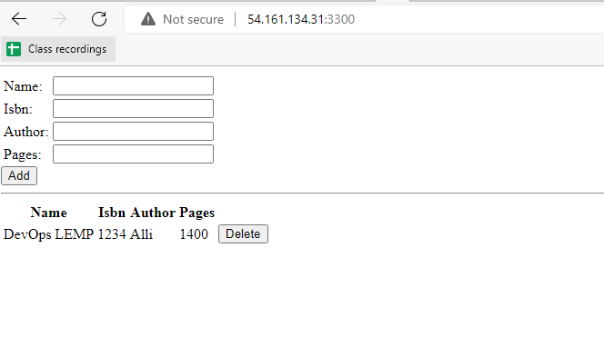

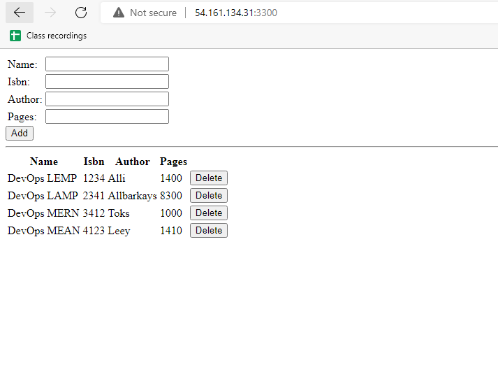

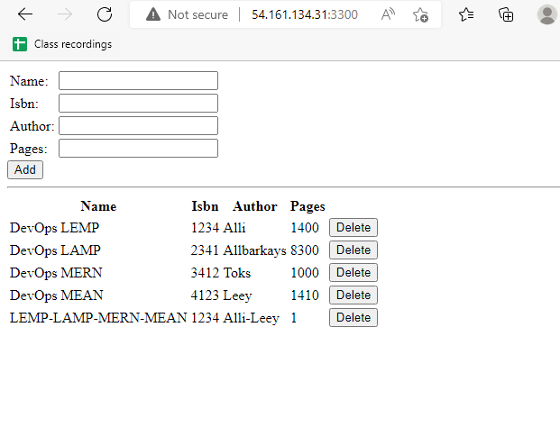

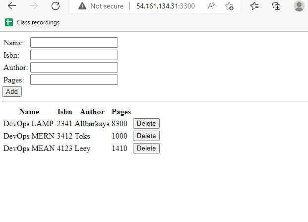

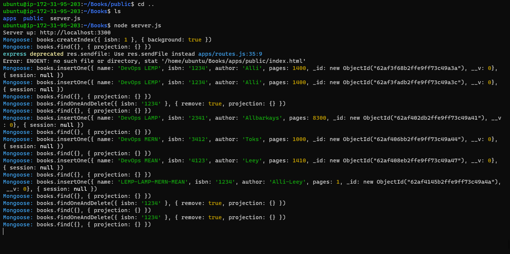

With this done, I can't wait to start more complex and fun *‘PBL Professional’* projects!!!
